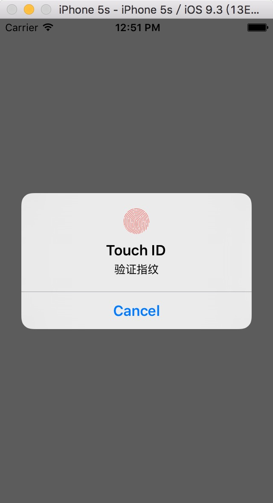

# TouchID
### iOS下TouchID指纹验证封装工具类
-----

## What 是什么

> iOS下TouchID指纹验证封装工具类

### 属性

#### ` delegate ` *Property* 

指纹验证的委托
	
* ##### 声明

	```
	@property (nonatomic, weak) id<LSTouchIDAuthDelegate> delegate 
	```

### 方法
#### ` + shareTouchID `

初始化方法（单例）。
	
* ##### 声明

	```
	+ (instancetype)shareTouchID
	```
	
* ##### 返回值
	返回LSTouchID的实例对象。
	
#### `- authWithRequestReason:`

请求TouchID指纹验证。

* ##### 声明

	```
	- (void)authWithRequestReason:(NSString *)reasonStr
	```

* ##### 参数列表

	| 参数名 | 描述 |
	| ------------ | ------------- |
	| reasonStr | 请求验证的原因 |

### 协议
#### LSTouchIDAuthDelegate
`LSTouchIDAuthDelegate` 协议包含了一组协议方法，这些协议方法囊括了TouchID验证成功及失败的各种情况下的回调方法，调用LSTouchID类的实例应签署该协议并至少实现必要的（@request）协议方法。

#### 协议方法

##### `- TouchIDNotFound` *Required*

设备不支持TouchID时回调该方法。

* ###### 声明

	```
	- (void)TouchIDNotFound
	```

##### `- TouchIDPassed` *Required*

通过了TouchID鉴权时回调此方法。

* ###### 声明

	```
	- (void)TouchIDPassed
	```

##### `- TouchIDAuthFailed` *Required*

连续三次指纹识别错误回调此方法。

* ###### 声明

	```
	- (void)TouchIDAuthFailed
	```

##### `- TouchIDUserCancel` *Required*

点击了取消按钮回调此方法。

* ###### 声明

	```
	- (void)TouchIDUserCancel
	```

##### `- TouchIDUserFallback` *Required*

点击了输入密码按钮。

* ###### 声明

	```
	- (void)TouchIDUserFallback
	```

##### `- TouchIDSystemCancel` *Optional*

系统终止了验证，比如按下电源键。

* ###### 声明

	```
	- (void)TouchIDSystemCancel
	```

##### `- TouchIDPasscodeNotSet` *Optional*

用户没有在设备Settings中设定密码。

* ###### 声明

	```
	- (void)TouchIDPasscodeNotSet
	```
	
##### `- TouchIDNotEnrolled` *Optional*

设备没有进行Touch ID 指纹注册。

* ###### 声明

	```
	- (void)TouchIDNotEnrolled
	```
	
##### `- TouchIDLockout` *optional*

Touch ID功能被锁定，下一次需要输入系统密码。

* ###### 声明

	```
	- (void)TouchIDLockout
	```
	
##### `- TouchIDAppCancel` *optional*

验证被应用取消。

* ###### 声明

	```
	- (void)TouchIDAppCancel
	```

##### `- TouchIDInvalidContext` *optional*

无效上下文。

* ###### 声明

	```
	- (void)TouchIDInvalidContext
	```

##### `- TouchIDFailed:` *optional*

返回错误对象，用户可以根据错误码自行处理。

* ###### 声明

	```
	- (void)TouchIDFailed:(NSError *)error
	```
* ###### 参数列表
 

	| 参数名 | 描述 |
	| ------------ | ------------- |
	| error | 错误对象 |
	
* ###### 细节

	参数error中携带了TouchID验证失败的具体细节信息，使用 `error.code` 可得到具体错误枚举值，枚举值如下表。

	| 枚举名称 | 描述 | 枚举值 |
	| ------------ | ------------- | ------------ |
	| kLAErrorAuthenticationFailed | 连续三次指纹识别错误  | -1 |
	| kLAErrorUserCancel | 点击了取消按钮  | -2 |
	| kLAErrorUserFallback | 点输入密码按钮 | -3 |
	| kLAErrorSystemCancel | 系统终止了验证，比如按下电源键 | -4 |
	| kLAErrorPasscodeNotSet | 用户没有在设备Settings中设定密码 |  -5 |
	| kLAErrorTouchIDNotAvailable | 设备不支持Touch ID | -6 |
	| kLAErrorTouchIDNotEnrolled | 设备没有进行Touch ID 指纹注册 | -7 |
	| kLAErrorTouchIDLockout | Touch ID功能被锁定，下一次需要输入系统密码 | -8 |
	| kLAErrorAppCancel | 验证被应用取消 | -9 |
	| kLAErrorInvalidContext  | 无效上下文 | -10 |


## How 如何使用

1. 将 **LSTouchID** 文件夹下的文件 **LSTouchID.h** 和 **LSTouchID.m** 拖入自己的工程。 
2. 引入头文件 `#import "LSTouchID.h"` 。
3. 签署 `<LSTouchIDAuthDelegate>` 协议。
4. 实例化LSTouchID并调用请求TouchID验证的方法 `[[LSTouchID shareTouchID] authWithRequestReason:@"验证指纹"];` 。
5. 设置委托 `[LSTouchID shareTouchID].delegate = self;` 。
6. 实现协议方法。

### 实例

```
//
//  ViewController.m
//  LSTouchID
//
//  Created by liushuai on 16/4/21.
//  Copyright © 2016年 liushuai1992@gmail.com. All rights reserved.
//

#import "ViewController.h"
#import "LSTouchID.h"  //引入头文件

@interface ViewController () <LSTouchIDAuthDelegate>

@end

@implementation ViewController

- (void)viewDidLoad {
    [super viewDidLoad];
    //实例化LSTouchID并请求指纹验证
    [[LSTouchID shareTouchID] authWithRequestReason:@"验证指纹"];
    //设置委托对象
    [LSTouchID shareTouchID].delegate = self;
}

- (void)didReceiveMemoryWarning {
    [super didReceiveMemoryWarning];
    // Dispose of any resources that can be recreated.
}

#pragma mark - LSTouchIDAuthDelegate methods
- (void)TouchIDPassed {
    NSLog(@"TouchID验证通过");
}

- (void)TouchIDNotFound {
    NSLog(@"设备不支持TouchID,应跳转至密码验证页面");
}

- (void)TouchIDAuthFailed {
    NSLog(@"连续三次指纹识别错误回调此方法");
}

- (void)TouchIDUserCancel {
    NSLog(@"用户取消验证");
}

- (void)TouchIDUserFallback {
    NSLog(@"点击了输入密码按钮");
}


@end

```



